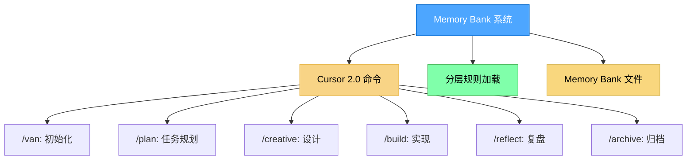

# 项目工作区

本工作区包含 Memory Bank 开发工作流系统和示例项目。

## 目录

- [项目内容](#项目内容)
  - [Memory Bank 系统](#1-memory-bank-系统)
  - [贪吃蛇游戏](#2-贪吃蛇游戏)
- [目录结构](#目录结构)
- [快速开始](#快速开始)
- [复杂度级别](#复杂度级别)
- [故障排除](#故障排除)

## 项目内容

### 1. Memory Bank 系统

位于 `.cursor/` 目录，这是一个经过令牌优化的分层任务管理系统，使用 Cursor 2.0 命令实现高效的开发工作流程。

#### 系统架构



#### 可用命令

| 命令 | 功能 |
|------|------|
| `/van` | 初始化项目，检测平台，确定任务复杂度 |
| `/plan` | 根据复杂度级别创建详细的实现计划 |
| `/creative` | 为需要设计决策的组件探索设计选项 |
| `/build` | 系统性地实现已规划的更改 |
| `/reflect` | 复盘已完成的工作并记录经验教训 |
| `/archive` | 创建完整的文档并更新 Memory Bank |

#### 工作流程

```
/van → /plan → /creative → /build → /reflect → /archive
```

#### 主要特性

- **令牌优化**：分层规则加载，减少约 70% 的初始令牌使用
- **渐进式文档**：随任务复杂度扩展的简洁模板
- **平台感知**：自动适应不同操作系统
- **统一上下文**：通过 Memory Bank 在命令之间保留上下文

### 2. 贪吃蛇游戏

位于 `snake-game/` 目录，这是一个使用纯 HTML/CSS/JavaScript 构建的经典贪吃蛇游戏。

#### 特性

- 现代化的 UI 设计，带有渐变背景和霓虹风格
- 支持键盘控制（方向键或 WASD）
- 支持移动端触摸控制和虚拟方向键
- 本地存储最高分记录
- 响应式设计，适配各种屏幕尺寸
- 游戏速度随得分增加而加快
- 蛇身渐变效果和动态眼睛

#### 运行方式

直接在浏览器中打开 `snake-game/index.html` 即可开始游戏。

#### 游戏控制

| 平台 | 控制方式 |
|------|----------|
| 桌面端 | 方向键 ↑↓←→ 或 WASD |
| 移动端 | 屏幕上的虚拟方向键或在画布上滑动 |
| 开始/重新开始 | 点击按钮或按空格键 |

## 目录结构

```
/workspace/
├── .cursor/
│   ├── commands/          # Cursor 2.0 命令文件
│   │   ├── van.md
│   │   ├── plan.md
│   │   ├── creative.md
│   │   ├── build.md
│   │   ├── reflect.md
│   │   └── archive.md
│   └── rules/
│       └── isolation_rules/   # 分层规则系统
│           ├── Core/          # 核心规则
│           ├── Level1/        # 第1级 - 快速修复
│           ├── Level2/        # 第2级 - 简单增强
│           ├── Level3/        # 第3级 - 中等功能
│           ├── Level4/        # 第4级 - 复杂系统
│           ├── Phases/        # 阶段规则
│           └── visual-maps/   # 可视化流程图
├── snake-game/
│   └── index.html         # 贪吃蛇游戏
└── README.md
```

## 快速开始

1. **使用 Memory Bank 系统**：在 Cursor 聊天中输入 `/van` 开始初始化项目
2. **玩贪吃蛇游戏**：打开 `snake-game/index.html`

## 复杂度级别

Memory Bank 根据任务复杂度调整工作流程：

| 级别 | 类型 | 工作流程 | 特征 |
|------|------|----------|------|
| 1 级 | 快速 Bug 修复 | `/van` → `/build` → `/reflect` → `/archive` | 单文件更改，针对性修复 |
| 2 级 | 简单增强 | `/van` → `/plan` → `/build` → `/reflect` → `/archive` | 多个文件，明确需求 |
| 3 级 | 中等功能 | `/van` → `/plan` → `/creative` → `/build` → `/reflect` → `/archive` | 新组件，需要设计决策 |
| 4 级 | 复杂系统 | `/van` → `/plan` → `/creative` → `/build` → `/reflect` → `/archive` | 多个子系统，架构决策 |

## 故障排除

### 命令未显示

- 确保使用 Cursor 2.0 或更高版本
- 验证 `.cursor/commands/` 目录存在
- 尝试重启 Cursor

### 命令工作不正常

- 检查 `memory-bank/` 目录是否存在
- 验证 `memory-bank/tasks.md` 中的任务状态
- 确保遵循正确的工作流程顺序

### Memory Bank 问题

- 运行 `/van` 初始化 Memory Bank 结构
- 检查文件权限是否正确

## 许可证

本项目仅供学习和参考使用。

---

*此工作区用于演示 Memory Bank 系统的使用和简单的 Web 项目开发。最后更新：2026 年 1 月*
