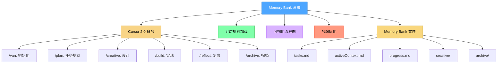
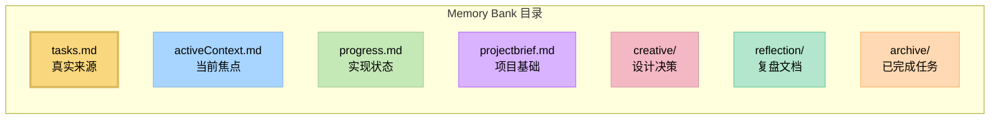

# Memory Bank 系统 v0.8

一个经过令牌优化的分层任务管理系统，使用 Cursor 2.0 命令实现高效的开发工作流程。



> **个人说明**：Memory Bank 是我为个人编程项目开发的业余项目。由于这是个人项目，我不维护问题跟踪器，也不主动收集反馈。不过，如果你正在使用这些规则并遇到问题，一个很大的优势是你可以直接让 Cursor AI 修改或更新规则，以更好地适应你的特定工作流程。该系统设计为可由 AI 进行调整，让你无需外部支持即可根据自己的需求进行定制。

## 关于 Memory Bank

Memory Bank 是一个结构化的开发工作流系统，使用 Cursor 2.0 命令引导你完成开发过程的不同阶段。它采用分层规则加载架构，仅加载每个阶段所需的规则，优化令牌使用并提供针对性的指导。

### 工作原理

0.8 版本从 Cursor 自定义模式转变为 Cursor 命令。Memory Bank 通过**六个专门命令**协同工作，形成一个集成的工作流程：

1. **`/van`** - 初始化项目，检测平台，确定任务复杂度
2. **`/plan`** - 根据复杂度级别创建详细的实现计划
3. **`/creative`** - 为需要设计决策的组件探索设计选项
4. **`/build`** - 系统性地实现已规划的更改
5. **`/reflect`** - 复盘已完成的工作并记录经验教训
6. **`/archive`** - 创建完整的文档并更新 Memory Bank

每个命令都从共享的 **Memory Bank** 目录（`memory-bank/`）读取和更新信息，在整个工作流程中维护持久的上下文。

### 令牌优化架构

0.7 版本引入了重大的令牌优化改进：

- **分层规则加载**：初始只加载基本规则，专门规则延迟加载（减少约 70% 的令牌消耗）
- **渐进式文档**：实现简洁的模板，随任务复杂度扩展
- **优化的命令转换**：高效地在命令之间保留关键上下文
- **级别特定的工作流程**：根据任务复杂度（1-4 级）调整文档要求
- **延迟加载的专门规则**：仅在需要时加载专门规则（例如架构设计 vs UI/UX 设计）

详细信息请参阅 [Memory Bank 优化](MEMORY_BANK_OPTIMIZATIONS.md) 文档。

### 基于命令的工作流系统

Memory Bank 将开发转变为结构化的、分阶段的过程：

- **基于图的命令集成**：命令是开发工作流中相互连接的节点
- **工作流推进**：命令按逻辑顺序依次转换（`/van` → `/plan` → `/creative` → `/build` → `/reflect` → `/archive`）
- **共享内存**：通过 Memory Bank 文件在命令转换之间维护持久状态
- **自适应行为**：每个命令根据项目复杂度级别调整其建议
- **渐进式规则加载**：命令仅加载必要的规则，减少上下文窗口的使用

这种方法将开发从临时编码转变为具有专门阶段协同工作的协调系统。

### CREATIVE 命令与 Claude 的"Think"工具

`/creative` 命令在概念上基于 Anthropic 的 Claude "Think"工具方法论，详见其[工程博客](https://www.anthropic.com/engineering/claude-think-tool)。0.8 版本实现了优化版本，包括：

- 带有表格选项比较的渐进式文档
- 保持令牌效率的"按需详细"方法
- 随复杂度级别扩展的结构化模板
- 为实现阶段高效保留上下文

有关 Memory Bank 如何实现这些原则的详细说明，请参阅 [CREATIVE 模式与 Claude 的"Think"工具](creative_mode_think_tool.md) 文档。

## 主要特性

- **Cursor 2.0 命令**：与 Cursor 的命令功能原生集成 - 无需设置
- **分层规则加载**：仅加载基本规则，专门规则延迟加载
- **渐进式文档**：随任务复杂度扩展的简洁模板
- **统一的上下文传递**：通过 Memory Bank 在命令之间高效保留上下文
- **命令特定的可视化图**：为每个开发阶段提供清晰的可视化表示
- **级别特定的工作流程**：基于复杂度（1-4 级）调整的流程
- **平台感知命令**：自动适应你的操作系统
- **Memory Bank 集成**：所有命令都从共享的 Memory Bank 文件读取和更新

## 安装说明

### 前提条件

- **Cursor 编辑器**：需要 2.0 或更高版本（命令功能）
- **AI 模型**：推荐 Claude 4 Sonnet 或 Claude 4 Opus 以获得最佳效果，特别是对于 `/creative` 命令的"Think"工具方法论

### 第一步：获取文件

只需将此仓库克隆到你的项目目录：

```bash
git clone https://github.com/vanzan01/cursor-memory-bank.git
```

#### 备选方案（手动）

从 ZIP 文件解压后：

- 将 `.cursor` 文件夹复制到你的项目目录（包含规则和命令）
- `custom_modes` 文件夹保留作为参考，但不是必需的

**注意**：其他文档对于 Memory Bank 操作不是必需的 - 它们是说明性文档。如有需要，你可以将它们复制到如 `memory_bank_documents` 这样的文件夹中。

### 第二步：使用命令

**命令可以立即使用！** 无需额外设置。

1. **在 Cursor 聊天中输入 `/`** 查看可用命令：
   - `/van` - 初始化和入口点
   - `/plan` - 任务规划
   - `/creative` - 设计决策
   - `/build` - 代码实现
   - `/reflect` - 任务复盘
   - `/archive` - 任务归档

2. **从 `/van` 开始**初始化你的项目：
   ```
   /van 初始化项目以添加用户认证功能
   ```

3. **跟随工作流程** - 每个命令都会引导你进入下一步

详细的命令文档请参阅 [`.cursor/commands/README.md`](.cursor/commands/README.md)。

## 基本用法

### 快速开始

1. **使用 `/van` 初始化**：
   ```
   /van 为应用程序添加用户认证
   ```
   - 分析你的项目结构
   - 确定任务复杂度（1-4 级）
   - 如需要则创建 Memory Bank 结构
   - 路由到适当的下一个命令

2. **根据复杂度跟随工作流程**：

   **第 1 级（快速 Bug 修复）：**
   ```
   /van → /build → /reflect → /archive
   ```

   **第 2 级（简单增强）：**
   ```
   /van → /plan → /build → /reflect → /archive
   ```

   **第 3-4 级（功能/系统）：**
   ```
   /van → /plan → /creative → /build → /reflect → /archive
   ```

### 命令参考

#### `/van` - 初始化和入口点
**用途**：初始化 Memory Bank，检测平台，确定任务复杂度，路由到工作流程。

**使用方法**：
```
/van [任务描述]
```

**功能**：
- 检测你的操作系统并调整命令
- 验证或创建 Memory Bank 结构
- 分析任务需求
- 确定复杂度级别（1-4）
- 使用初始任务信息更新 `memory-bank/tasks.md`

**后续步骤**：
- 第 1 级 → `/build`
- 第 2-4 级 → `/plan`

#### `/plan` - 任务规划
**用途**：根据复杂度级别创建详细的实现计划。

**使用方法**：
```
/plan
```

**功能**：
- 从 `memory-bank/tasks.md` 读取任务需求
- 审查代码库结构
- 创建实现计划（复杂度适当）
- 执行技术验证（第 2-4 级）
- 识别需要创意阶段的组件
- 使用完整计划更新 `memory-bank/tasks.md`

**后续步骤**：
- 已识别创意阶段 → `/creative`
- 无创意阶段 → `/build`

#### `/creative` - 设计决策
**用途**：为标记的组件执行结构化的设计探索。

**使用方法**：
```
/creative
```

**功能**：
- 从 `memory-bank/tasks.md` 读取标记为需要创意工作的组件
- 对每个组件探索多个设计选项
- 分析每种方法的优缺点
- 选择并记录推荐的方法
- 创建 `memory-bank/creative/creative-[功能名称].md` 文档
- 使用设计决策更新 `memory-bank/tasks.md`

**后续步骤**：
- 所有创意阶段完成后 → `/build`

#### `/build` - 代码实现
**用途**：按照计划和创意决策实现规划的更改。

**使用方法**：
```
/build
```

**功能**：
- 从 `memory-bank/tasks.md` 读取实现计划
- 读取创意阶段文档（第 3-4 级）
- 系统性地实现更改
- 测试实现
- 记录执行的命令和结果
- 更新 `memory-bank/tasks.md` 和 `memory-bank/progress.md`

**后续步骤**：
- 实现完成后 → `/reflect`

#### `/reflect` - 任务复盘
**用途**：促进对已完成实现的结构化复盘。

**使用方法**：
```
/reflect
```

**功能**：
- 审查已完成的实现
- 与原始计划进行比较
- 记录做得好的方面
- 记录遇到的挑战
- 记录经验教训
- 记录流程和技术改进
- 创建 `memory-bank/reflection/reflection-[任务ID].md`
- 使用复盘状态更新 `memory-bank/tasks.md`

**后续步骤**：
- 复盘完成后 → `/archive`

#### `/archive` - 任务归档
**用途**：创建完整的归档文档并更新 Memory Bank。

**使用方法**：
```
/archive
```

**功能**：
- 读取复盘文档和任务详情
- 创建完整的归档文档
- 归档创意阶段文档（第 3-4 级）
- 更新 `memory-bank/tasks.md` 标记任务为完成
- 使用归档引用更新 `memory-bank/progress.md`
- 重置 `memory-bank/activeContext.md` 为下一个任务做准备
- 创建 `memory-bank/archive/archive-[任务ID].md`

**后续步骤**：
- 归档完成后 → `/van`（进行下一个任务）

### 示例工作流程

以下是第 3 级功能的完整示例工作流程：

```bash
# 第 1 步：初始化
/van 添加支持 OAuth2 的用户认证

# 第 2 步：规划（VAN 为第 3 级路由到 PLAN）
/plan

# 第 3 步：探索 OAuth 集成的设计选项
/creative

# 第 4 步：实现功能
/build

# 第 5 步：复盘实现
/reflect

# 第 6 步：归档已完成的任务
/archive
```

## Memory Bank 结构

所有 Memory Bank 文件都存储在 `memory-bank/` 目录中：



### 核心文件

- **`tasks.md`**：任务跟踪、检查列表和组件列表的中央真实来源
- **`activeContext.md`**：维护当前开发阶段的焦点
- **`progress.md`**：跟踪实现状态和观察结果
- **`projectbrief.md`**：项目基础和上下文
- **`productContext.md`**：产品特定的上下文和需求
- **`systemPatterns.md`**：系统模式和架构决策
- **`techContext.md`**：技术上下文和技术栈

### 生成的文件

- **`creative/creative-[功能名称].md`**：设计决策文档（第 3-4 级）
- **`reflection/reflection-[任务ID].md`**：复盘文档
- **`archive/archive-[任务ID].md`**：已完成任务的归档文档

## 渐进式规则加载

每个命令实现渐进式规则加载以优化上下文使用：

1. **核心规则** - 始终首先加载
   - `main.mdc` - 系统基础
   - `memory-bank-paths.mdc` - 文件路径定义

2. **命令特定规则** - 根据命令加载
   - 可视化流程图（例如 `van-mode-map.mdc`）
   - 命令特定的工作流程

3. **复杂度特定规则** - 根据任务复杂度加载
   - 第 1 级：`workflow-level1.mdc`
   - 第 2 级：`workflow-level2.mdc`、`task-tracking-basic.mdc`
   - 第 3 级：`workflow-level3.mdc`、`planning-comprehensive.mdc`
   - 第 4 级：`workflow-level4.mdc`、`architectural-planning.mdc`

4. **专门规则** - 仅在需要时延迟加载
   - 创意阶段类型（架构、UI/UX、算法）
   - 高级验证规则
   - 平台特定适配

与一次性加载所有规则相比，这种方法减少了约 **70%** 的初始令牌使用。

## 复杂度级别

Memory Bank 根据任务复杂度调整其工作流程：

### 第 1 级：快速 Bug 修复
- **工作流程**：`/van` → `/build` → `/reflect` → `/archive`
- **特征**：单文件更改，针对性修复
- **文档**：最小化，专注于修复

### 第 2 级：简单增强
- **工作流程**：`/van` → `/plan` → `/build` → `/reflect` → `/archive`
- **特征**：多个文件，明确的需求
- **文档**：基本计划，实现步骤

### 第 3 级：中等功能
- **工作流程**：`/van` → `/plan` → `/creative` → `/build` → `/reflect` → `/archive`
- **特征**：新组件，需要设计决策
- **文档**：完整计划，创意阶段，详细复盘

### 第 4 级：复杂系统
- **工作流程**：`/van` → `/plan` → `/creative` → `/build` → `/reflect` → `/archive`
- **特征**：多个子系统，架构决策
- **文档**：分阶段实现，架构图，完整归档

## 故障排除

### 命令未显示

- **验证 Cursor 版本**：确保你使用的是 Cursor 2.0 或更高版本
- **检查文件位置**：确保项目根目录中存在 `.cursor/commands/` 目录
- **重启 Cursor**：有时需要重启才能检测到新命令

### 命令工作不正常

- **检查 Memory Bank**：验证 `memory-bank/` 目录是否存在
- **验证任务状态**：检查 `memory-bank/tasks.md` 中的当前任务状态
- **审查命令顺序**：确保你遵循正确的工作流程顺序
- **检查规则**：验证 `.cursor/rules/isolation_rules/` 目录是否存在

### 规则未加载

- **验证文件路径**：确保规则文件在 `.cursor/rules/isolation_rules/` 中
- **检查文件权限**：验证文件是否可读
- **审查命令日志**：检查命令尝试加载哪些规则

### Memory Bank 问题

- **缺少文件**：运行 `/van` 初始化 Memory Bank 结构
- **状态损坏**：检查 `memory-bank/tasks.md` 中的任务状态
- **文件冲突**：审查最近对 Memory Bank 文件的更改

## 旧版自定义模式（已弃用）

> **注意**：自定义模式已被弃用，改为使用 Cursor 2.0 命令。如果你使用的是 Cursor 2.0+，请改用命令。自定义模式设置说明仅在 `custom_modes/` 目录中保留作为参考。

如果你使用的是不支持命令的旧版 Cursor，请参阅[命令迁移指南](COMMANDS_MIGRATION.md)了解旧版自定义模式设置的信息。

## 版本信息

这是 Memory Bank 系统的 v0.8 版本。它在保持所有功能的同时，相比 v0.7-beta 引入了重大的令牌优化改进。详细的更改信息请参阅[发布说明](RELEASE_NOTES.md)。

### 持续开发

Memory Bank 系统正在积极开发和改进中。需要了解的要点：

- **进行中的工作**：这是一个正在开发中的测试版本。预计会有定期更新、优化和新功能。
- **功能优化**：模块化架构使持续改进成为可能，而不会破坏现有功能。
- **旧版本可用**：如果你更喜欢旧版本（v0.1-legacy）的稳定性，可以在此版本成熟期间继续使用它。
- **架构优势**：在决定使用哪个版本之前，请阅读 [Memory Bank 升级指南](memory_bank_upgrade_guide.md)以了解新架构的显著优势。

## 资源

- [命令文档](.cursor/commands/README.md) - 详细的命令使用指南
- [命令迁移指南](COMMANDS_MIGRATION.md) - 从自定义模式迁移到命令
- [Memory Bank 优化](MEMORY_BANK_OPTIMIZATIONS.md) - 令牌效率改进的详细概述
- [发布说明](RELEASE_NOTES.md) - 最新更改信息
- [Memory Bank 升级指南](memory_bank_upgrade_guide.md) - 了解新架构
- [CREATIVE 模式与 Claude 的"Think"工具](creative_mode_think_tool.md) - 设计方法论说明

## 贡献

如上述个人说明所述，Memory Bank 是一个个人项目。但是，如果你发现它有用并想为自己的需求进行调整，你可以：

1. **询问 Cursor AI**：直接使用 Cursor AI 修改规则和命令
2. **分叉和定制**：克隆仓库并调整以适应你的工作流程
3. **分享改进**：如果你做出了有用的改进，考虑与社区分享

---

*注意：此 README 适用于 v0.8，随着系统演进可能会发生变化。*
